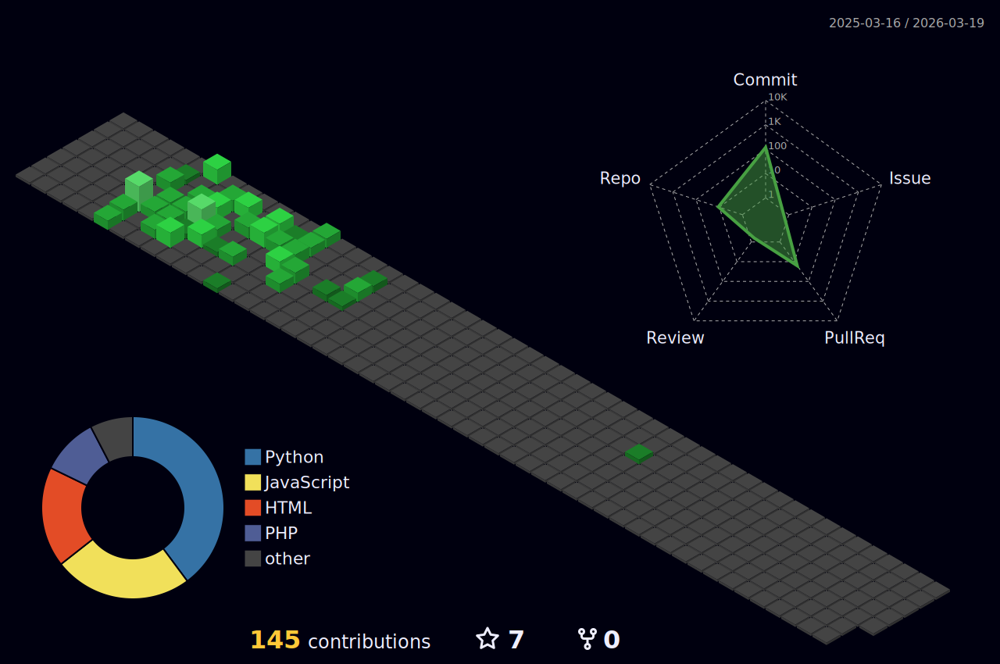

## Oi! Eu sou a Aisha :)

Estudante de **Análise e Desenvolvimento de Sistemas** na FATEC Taquaritinga  

  
  
   

---

## 💡 Atualmente estudando:

- 📊 **Processamento de dados com Python**  
- 🧠 **Machine Learning e Inteligência Artificial**  

---

## 🛠️ Tecnologias que uso no dia a dia

 
  
  
  
  
  
  
  
  

